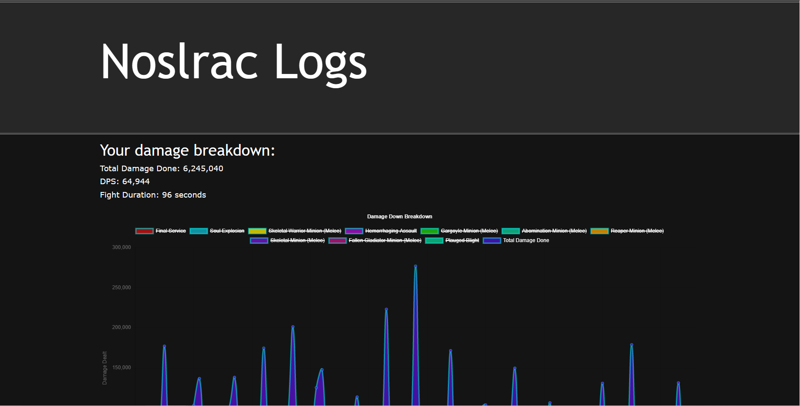

# Noslrac Logs
Noslrac Logs is a simple Noslrac combat logs reader and simple display for information gathered from such combat logs. The purpose of Noslrac Logs is to be a lightweight logs reader whilst showing about the same necessary data. This application has been inspired by [https://www.warcraftlogs.com/](Warcraft Logs) for the MMORPG: World of Warcraft.

Noslrac is a casual dungeon crawler ARPG with 4 unique classes with differing playstyles. Choose your conqueror, level up, slay monsters, complete campaigns, conqueror the darkest dungeons, obtain powerful items, and craft the ultimate items to cleanse Banglesway of corruption.

**Please Note**: Noslrac is developed by Silas Carlson and this repository is also mannaged by Silas Carlson. Therefore you can find all event formats in the [./js/eventtemplates.js](eventtemplates.js) file, and expect it to  be up to date if you desire to make your own custom logs reader. Please be aware that this site will not be hosted anywhere, this is for personal use.

**Todo**
1. Update Chart.js into the latest version (or rewrite the entire graph section).
2. Display the amount of crushing blows a certain source has inflicted.
3. Combine similar sources into the same source (i.e. King's Despair and Despair). Allow the user to click on the source and it will be a dropdown showing the specific sources.
4. Consider rewriting the codebase to React.js

**Features**
- Display the DPS of the player over the duration of combat
- See DPS during certain intervals of a fight
- Get amount of hits an ability did

**Programming Languages Used**
- HTML
- CSS
- Javascript

**External Libraries**
- Chart.js (included)

## Contributing
We allow all contributions to be made. Please make sure to open up a merge request in order to contribute.

## Screenshots

You are able to use this file and modify it however you want. However, you are not allowed to host it, for free or commercial.

(c) 2023 Silas Carlson. All Rights Reserved.